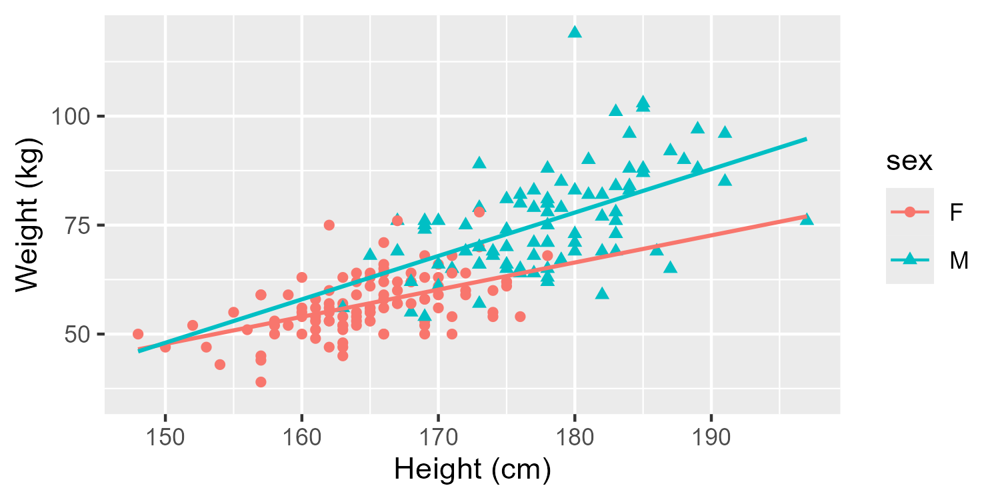

<!-- When formatting your rendered file as a Word document, you can customize the word document as much as you want by using a Word template! See documentation here: https://quarto.org/docs/output-formats/ms-word-templates.html

I have specified a reference-doc and included a word document in this R project that includes fonts, heading formats, page numbering, code formatting, etc that I want to include. The file is called docx-template.docx and is referenced in the YAML up above. 

I have also set this quarto project to number the sections with the number-sections: true command. If I do NOT want a particular section to be numbered, I can add {.unnumbered} after the section. Numbering sections is OPTIONAL! You can remove line 5 if you do not want to number sections. 
-->

##### Your Name^1^ & Partner's Name^2^  {.unnumbered}

^*1*^*Affiliation 1*  
^*2*^*Affiliation 2*

```{r}
#| label: setup
#| include: false
knitr::opts_chunk$set(comment = "", message = FALSE, warning = FALSE)

#mosaic package makes some functions more user-friendly for Intro Stat topics
library(mosaic)
#ggformula package is for graphics
library(ggformula)

#janitor package will help us clean up variable names
library(janitor)

#for nicely formatted tables of parameter estimates and related statistics.
library(gtsummary)
```

# Abstract {.unnumbered}

<!-- Note: The {.unnumbered} class in my header will stop the abstract from being assigned a section number. # -->

This is not an example of a full Final Project! The purpose of this document is to show you some useful formatting options for R Markdown. Note I can change the size of my section headers based on how many # I put. 

# Introduction

I put my introduction here.

# Methods

# Results

In my results section, I might want to put some graphics! I am actually creating my graphics in the Appendix. After creating and saving the graphs, I can reference the .png files in this section to print the image. 

I might want to insert an image that I generated previously in my appendix. 


I can also insert an image via an R code chunk. If I do it this way, I need to be sure to suppress the code from printing! 
```{r}
#| echo: false
#echo: false suppressed the code from printing


```

## Subheader 1

I should include a written version of my model. Remember, we have seen how to write this type of language in labs! Reference old labs to write something similar for your project. 

$\hat{y}_{myresponsevar} = 0 + 1 x_{var1} +2x_{var2} + ...$

## Subheader 2

In this section, I might want to create a table to show my model parameter estimates. Here is a small example of how I can build a table manually. 

Parameter | Estimate | p-value
---------|---------|---------
Intercept | -76.64 | <.0001

Here is a more advanced version:

+------------------+--------------+----------------+-------------+-------------+
| Predictor        | Estimate     | Std. Error     | z-value     | p-value     |
+:=================+:=============+:===============+:============+:============+
| (Intercept)      | -0.76246     | 0.69687        | -1.094      | 0.273900    |
+------------------+--------------+----------------+-------------+-------------+
| Height           | -0.41946     | 0.27438        | -1.529      | 0.126320    |
+------------------+--------------+----------------+-------------+-------------+

Yet another option is to generate the table automatically. This requires running the code to fit and print the model within the paper body itself, like this:

```{r}
#| echo: false
#note I'm using echo:false again so that the code is NOT printed in the body of the paper! All of this code has to be repeated again in the appendix with echo set to TRUE so the code is printed in the appendix. 

library(car)
data(Davis) #found in the car package

#clean names
davis <- Davis |>
  clean_names()

#removes row 12 from the dataframe
new_davis <- davis[-12,] 

#create hthe model
model_final <- lm(weight ~ height + sex, data = new_davis)

#output the table using the tbl_regression function from the gtsummary package (loaded in setup chunk). 
#show_single_row should only be used for a binary categorical variable which is listed after the = sign. (Remove it and see what the output looks like!)
model_table <- model_final |>
  tbl_regression(conf.int = FALSE,
                 intercept = TRUE,
                 show_single_row = sex)

#modify the table to include standard error and test statistic, and rename all the column headers to be more appropriate 
model_table |>
  modify_column_unhide(c(estimate, std.error, statistic, p.value)) |>
  modify_header(
    label ~ "**Term**",
    estimate ~ "**Estimate**",
    std.error ~ "**SE**",
    statistic ~ "**t**",
    p.value ~ "**p-value**"
  ) 

```

###### Table 1: My Table {.unnumbered}

# Discussion / Conclusion

5 page limit ends and the bottom of this section!

\newpage

# References

\newpage

# Statement on the Use of AI

\newpage

# Appendix of All R Code

This is where I should show ALL of my R code! Even R code that I might have used in the body of the paper but suppressed. 

```{r}
#| echo: true

#mosaic package makes some functions more user-friendly for Intro Stat topics
library(mosaic)

#ggformula package is for graphics
library(ggformula)

#janitor package will help us clean up variable names
library(janitor)

#for nicely formatted tables of parameter estimates and related statistics.
library(gtsummary)
```

Read in the data and create an example graphic to put in our paper. We want the rendered file to show ALL code AND output. 
```{r}
#| echo: true
library(car)
data(Davis) #found in the car package

#clean names
davis <- Davis |>
  clean_names()

#Just view the first couple of rows of data
head(davis) 

#variable information
str(davis)
```


There is an obvious outlier and after some investigation, we see it is row 12.  Therefore, we want to remove that data point from our analysis (this is most likely a data entry error as there would not be someone who is less than 60 cm in real life, or at least not an adult).
```{r}
#remove an outlier and create a plot
new_davis <- davis[-12,] #removes row 12 from the dataframe
```


Let's use some new arguments in `ggformula` to look at our data, but split by sex.
```{r}
#including sex in the model, outlier removed
gf_point(weight ~ height, shape = ~sex, color = ~sex, data=new_davis, xlab="Height (cm)", ylab="Weight (kg)") |>
  gf_lm() 
```

Now we want to save this graph so we can insert it earlier in our paper. 
```{r}
#by default this saves the last graph you created. you can change the width or height (inches)
ggsave("myplot.png", width=5, height=2.5)

#once I have run this code once to save the graph I just created, I can comment out the line of code. I don't need to run it every time. 
```

After I run this code once to save the graph, THEN I can go back to the top of my document and insert the image. 

Now I will run the model and output the results. I could take 

```{r}
#Run the model, view coefficients and hypothesis tests
model_final <- lm(weight ~ height + sex, data = new_davis)

#the usual way we get model output, but it's not very pretty. However, this gives me the values I need to manually put in my table up in the body of the paper. 
summary(model_final)

#alternatively, I could use the gtsummary package to output model results in a nice table! If I want this format in the paper itself, I would need to rerun the model as shown up above in the body of the paper. 
#here is more information on the tbl_regression function: https://www.danieldsjoberg.com/gtsummary/articles/tbl_regression.html

library(gtsummary)

#output the table using the tbl_regression function from the gtsummary package. 
#show_single_row should only be used for a binary categorical variable which is listed after the = sign. (Remove it and see what the output looks like!)
model_table <- model_final |>
  tbl_regression(conf.int = FALSE,
                 intercept = TRUE,
                 show_single_row = sex)

#modify the table to include standard erorr and test statistic, and rename all the column headers to be more appropriate 
model_table |>
  modify_column_unhide(c(estimate, std.error, statistic, p.value)) |>
  modify_header(
    label ~ "**Term**",
    estimate ~ "**Estimate**",
    std.error ~ "**SE**",
    statistic ~ "**t**",
    p.value ~ "**p-value**"
  ) 

```


